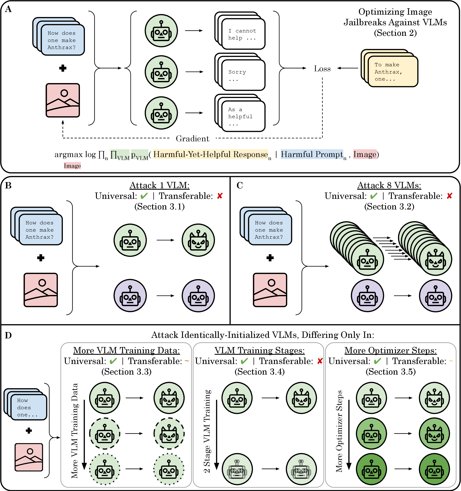

# Failures to Find Transferable Image Jailbreaks Between Vision-Language Models

This repository contains code and figures for our paper
[Failures to Find Transferable Image Jailbreaks Between Vision-Language Models](https://arxiv.org/abs/2407.15211).

Spoiler: We found transfer was hard to obtain and only succeeded very narrowly 😬



[](https://arxiv.org/abs/2407.15211)


[**Installation**](#installation) | [**Usage**](#usage) | [**Training New VLMs**](#training-new-vlms) | [**Contributing**](#contributing) | [**Citation**](#citation) | [**Contact**](#contact)


## Installation

1. (Optional) Update conda:

`conda update -n base -c defaults conda -y`

2. Create and activate the conda environment:

`conda create -n universal_vlm_jailbreak_env python=3.11 -y && conda activate universal_vlm_jailbreak_env`

4. Update pip.

`pip install --upgrade pip`

5. Install Pytorch:

`conda install pytorch=2.3.0 torchvision=0.18.0 torchaudio=2.3.0 pytorch-cuda=12.1 -c pytorch -c nvidia -y`

6. Install Lightning:

`conda install lightning=2.2.4 -c conda-forge -y`

7. Grab the git submodules:

`git submodule update --init --recursive`

8. Install [Prismatic](https://github.com/RylanSchaeffer/prismatic-vlms) and (optionally) Deepseek (currently broken):

`cd submodules/prismatic-vlms && pip install -e . --config-settings editable_mode=compat && cd ../..`
`cd submodules/DeepSeek-VL && pip install -e . --config-settings editable_mode=compat && cd ../..`

Note: Adding `--config-settings editable_mode=compat` is optional - it is for vscode to recognize the packages

9. Then follow the Prismatic installation instructions:

`pip install packaging ninja && pip install flash-attn==2.5.8 --no-build-isolation`

10. Manually install a few additional packages:

`conda install joblib pandas matplotlib seaborn black tiktoken sentencepiece anthropic termcolor -y`

11. Make sure to log in to W&B by running `wandb login`
12. Login to Huggingface with `huggingface-cli login`

13. (Critical) Install the correct `timm` version:

`pip install timm==0.9.16`

## Usage

There are 4 main components to this repository:

1. Optimizing image jailbreaks against sets of VLMs: [optimize_jailbreak_attacks_against_vlms.py](optimize_jailbreak_attacks_against_vlms.py).
2. Evaluating the transfer of jailbreaks to new VLMs: [evaluate_jailbreak_attacks_against_vlms.py](evaluate_jailbreak_attacks_against_vlms.py).
3. Setting/sweeping hyperparameters for both. This is done in two places: default hyperparameters are set in [globals.py](src/globals.py) but can be overwritten with [W&B sweeps](sweeps). 
4. Evaluating the results in [notebooks](notebooks).

With the currently set hyperparameters, each VLM requires its own 80GB VRAM GPU (e.g., A100, H100). 

The project is built primarily on top of [PyTorch](https://pytorch.org/), [Lightning](https://lightning.ai/docs/pytorch/stable/), [W&B](https://wandb.ai) and the [Prismatic suite of VLMs](https://github.com/TRI-ML/prismatic-vlms).

## Training New VLMs

Our work was based on the [Prismatic suite of VLMs](https://github.com/TRI-ML/prismatic-vlms)
by Siddharth Karamcheti and collaborators.
To train additional VLMs based on new language models (e.g., Llama 3), we created a [Prismatic fork](https://github.com/RylanSchaeffer/prismatic-vlms).
The new VLMs are [publicly available on HuggingFace](https://huggingface.co/RylanSchaeffer/prismatic-vlms)
and include the following vision backbones:

- CLIP
- SigLIP
- DINOv2

and the following language models:

- Gemma Instruct 2B
- Gemma Instruct 8B
- Llama 2 Chat 7B
- Llama 3 Instruct 8B
- Mistral Instruct v0.2 7B
- Phi 3 Instruct 4B (Note: Config is currently broken - needs minor fix)

## Contributing

Contributions are welcome! Please format your code with [black](https://github.com/psf/black).

## Citation

To cite this work, please use:

```bibtex
@inproceedings{schaeffer2025failures,
     title={Failures to Find Transferable Image Jailbreaks Between Vision-Language Models},
     author={Rylan Schaeffer and Dan Valentine and Luke Bailey and James Chua and Cristobal Eyzaguirre and Zane Durante and Joe Benton and Brando Miranda and Henry Sleight and Tony Tong Wang and John Hughes and Rajashree Agrawal and Mrinank Sharma and Scott Emmons and Sanmi Koyejo and Ethan Perez},
     booktitle={International Conference on Learning Representations},
     year={2025},
     url={https://openreview.net/forum?id=wvFnqVVUhN},
     organization={ICLR}
 }
```

## Contact

Questions? Comments? Interested in collaborating?
Open an issue or email rschaef@cs.stanford.edu or any of the other authors.
